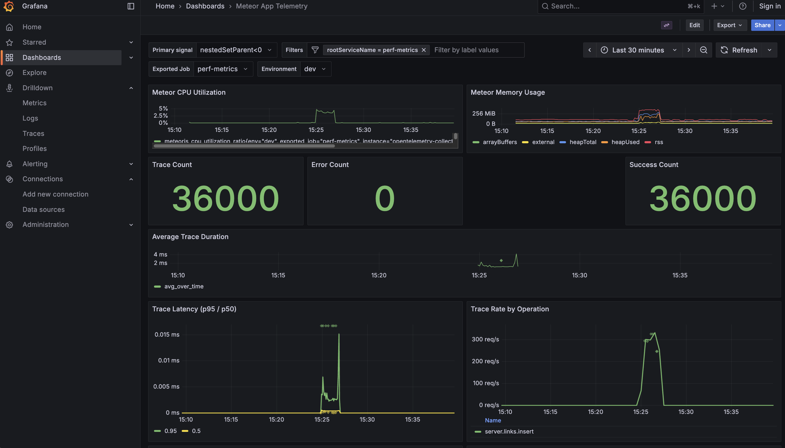
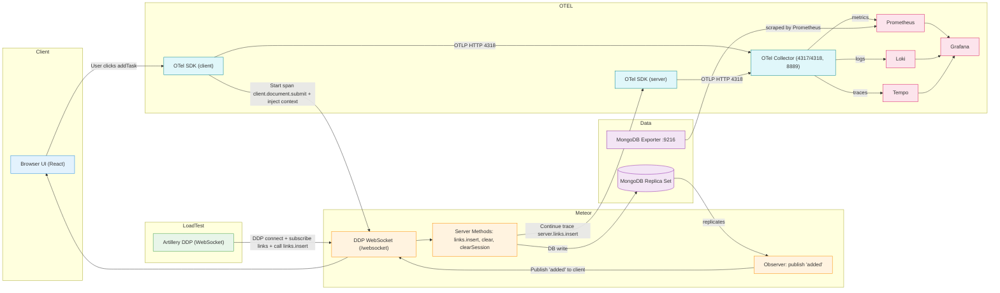
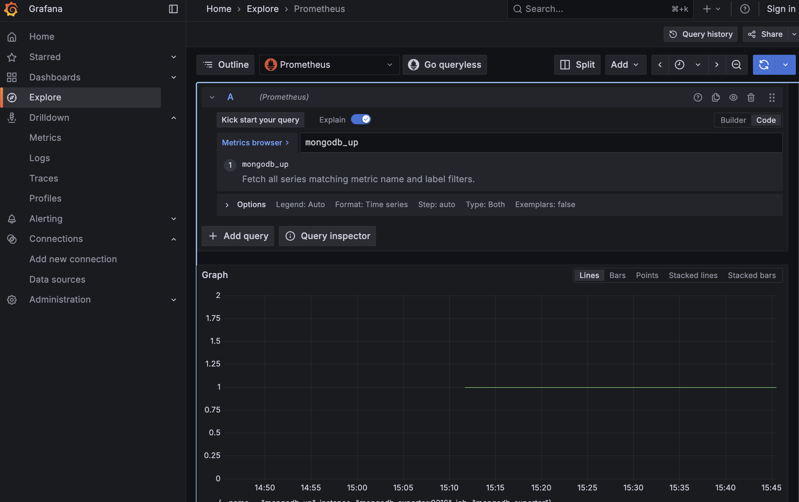
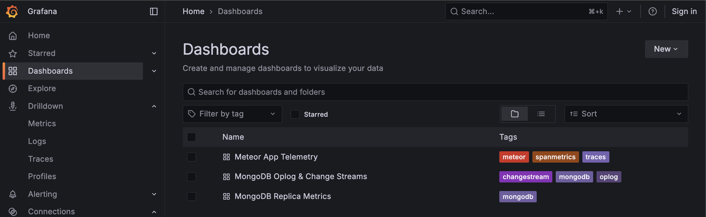

# Otel

This folder is a WIP project that will be integrated into the main repo later. All content here is experimental; feel free to send PRs.

## Perf Metrics Stack

An end-to-end local observability sandbox for a Meteor application, bundling:

- Meteor app (React UI + DDP methods/publications)
- OpenTelemetry SDK (client + server) with OTLP export
- OpenTelemetry Collector (OTLP gRPC/HTTP, Prometheus exporter, Loki/Tempo exporters)
- Prometheus (metrics)
- Grafana (dashboards, pre-provisioned data sources and plugins)
- Tempo (traces)
- Loki (logs)
- Optional MongoDB Replica Set for local dev + MongoDB Exporter (Prometheus)

This repo is great for testing full-fidelity tracing from browser ➝ Meteor server ➝ DB, with metrics and logs all in one place.



## Contents

- Overview
- Architecture & Ports
- Prerequisites
- Quick Start
- Application Features
- OpenTelemetry Instrumentation
- Observability (Prometheus, Grafana, Tempo, Loki)
- MongoDB Exporter Health Checks
- Add Panels/Dashboards in Grafana
- Load & Click Testing
- MongoDB Replica Set (Local Dev)
- Configuration
- Troubleshooting
- Next Steps


## Overview

This project contains a Meteor app instrumented with OpenTelemetry to collect application telemetry (metrics, traces, and logs). The UI lets you manually insert and delete entries in the `links` collection, and when you click "addTask" the browser starts a span, injects context over DDP, and the server continues the trace while writing to MongoDB. A server-side observer then emits another span when the document replicates back to the client via publication.

Important: although the UI exists for manual exploration, the current automated and load tests drive the server only through raw DDP WebSocket connections (no browser automation). The tests connect, subscribe to `links`, invoke `links.insert` repeatedly, and measure the time from the client-supplied `createdAt` until the corresponding `added` message is received.

Telemetry from both client and server is exported via OTLP/HTTP to the local OpenTelemetry Collector, which in turn exposes metrics to Prometheus, sends traces to Tempo, and logs to Loki. Grafana is pre-provisioned to explore all three.

### End-to-end flow




## Architecture & Ports

Services are defined in `docker-compose.yaml`.

- Meteor app: default http://localhost:3000 (see note about 8080 below)
- Grafana: http://localhost:3000 in-container, but mapped from the container to host at http://localhost:3000 (default Grafana port)
- Prometheus: http://localhost:9090
- Loki API: http://localhost:3100
- Tempo: http://localhost:3200
- OTEL Collector:
	- Metrics (Prometheus scrape): 8888/8889
	- OTLP gRPC: 4317
	- OTLP HTTP: 4318
- MongoDB Exporter (Prometheus): 9216
- MongoDB Replica Set (host-mapped): 27017, 27018, 27019

Important: some test scripts in this repo target the Meteor app at port 8080 (e.g., Artillery config and Puppeteer script). If you run Meteor on 3000 (default), update the scripts to 3000 or run Meteor with `PORT=8080`.


## Prerequisites

- macOS, Linux, or Windows with WSL2
- Docker and Docker Compose
- Node 18+ and npm


## Quick Start

1) Start the observability stack (Mongo replica set is optional but enabled by default):

```bash
docker compose up -d
```

2) Install Node dependencies and start the Meteor app:

```bash
meteor npm install
npm run start
# it runs the app on port 8080 by default
```

3) Open the UI and press "addTask" a few times:

- App: http://localhost:3000 (or http://localhost:8080 if you changed PORT)

4) Explore telemetry:

- Grafana: http://localhost:3000
- Prometheus: http://localhost:9090
- Tempo: http://localhost:3200
- Loki: http://localhost:3100

Default Grafana is pre-provisioned and allows anonymous admin access for local dev.


## Application Features

- UI (`imports/ui/Info.jsx`):
	- Shows a Session ID unique to the browser tab
	- Buttons: `addTask`, `EraseDB`, `EraseSession`
	- Subscribes to `links` and renders recent documents
- Server (`server/main.js`):
	- Publication `links`
	- Methods `links.insert`, `links.clear`, `links.clearSession`
	- Inserts store minimal OTEL parent carrier in the document for observer correlation
- Data model (`imports/api/links.js`): `links` collection

Trace flow per insert:

1) Browser starts span `client.document.submit`
2) Trace context injected into a DDP method call
3) Server continues trace in `server.links.insert`
4) Observer creates `server.document.added` when the document arrives to the client via pub/sub


## OpenTelemetry Instrumentation

- Client and server OTEL setup lives in `meteor-opentelemetry/` (we should install the original [package](https://github.com/danopia/meteor-opentelemetry#nodejs-instrumentation-setup) later)
- Settings are driven by `settings.json` → `packages.danopia:opentelemetry`
- Default OTLP endpoint: `http://localhost:4318` (the Collector)
- Relevant pieces:
	- `meteor-opentelemetry/opentelemetry-client.js` (client entry)
	- `meteor-opentelemetry/opentelemetry-server.js` (server entry)
	- `imports/clients/links-otel.js` (span creation, context injection/extraction, observer spans)
	- `meteor-opentelemetry/otel-platform/exporter-config.ts` (OTLP http config helper)

Collector pipelines (`infra/otel-collector-config.yml`):

- Receivers: OTLP (gRPC + HTTP)
- Exporters: Prometheus (metrics), Tempo (traces), Loki (logs), Debug
- Processors: batch, attributes (adds `env`)

Prometheus scrape config (`infra/prometheus.yaml`):

- Scrapes `opentelemetry-collector:8889` and `mongodb-exporter:9216`


## Observability (Grafana, Tempo, Loki, Prometheus)

- Grafana is pre-provisioned with data sources for Prometheus, Loki, and Tempo
- Plugins installed via env (e.g., Grafana Traces app)
- Start points:
	- Explore → Traces (Tempo)
	- Explore → Logs (Loki)
	- Explore → Metrics (Prometheus)

Suggested queries:

- Tempo: service.name = `meteor-host`
- Loki: filter by label `{env="dev"}` or your log attributes
- Prometheus: `links_roundtrip_createdAt_ms_bucket` (from load test) and Mongo exporter metrics


## MongoDB Exporter Health Checks

Ways to confirm the Percona MongoDB Exporter is up and being scraped:

1) Prometheus targets page (should show mongodb-exporter UP)

```bash
open "http://localhost:9090/targets"
```

2) Quick PromQL checks (Grafana → Explore → Metrics with Prometheus data source)

- `up{job="mongodb-exporter"}` should be 1
- `sum(mongodb_up)` should be ≥ 1

3) Curl the exporter directly on the host

```bash
curl -sSf http://localhost:9216/metrics | head -n 20
```

4) Check container status and logs

```bash
docker compose ps mongodb-exporter
docker compose logs -f mongodb-exporter
```

If the exporter is down or empty:

- Verify the replica set hostnames are resolvable (see “MongoDB Replica Set”).
- Ensure Prometheus includes the target (see `infra/prometheus.yaml`).
- Confirm `mongodb-exporter` is running with `--collect-all` and a valid `MONGODB_URI`.




## Add Panels/Dashboards in Grafana

You can add visualizations either via Grafana UI (quickest for local dev) or via provisioning files (reproducible and versioned).

Option A — Grafana UI

1) Open Grafana → Dashboards → New → New dashboard → Add visualization
2) Pick a data source:
	 - Prometheus (metrics), Loki (logs), Tempo (traces)
3) Write a query, e.g. Prometheus examples:
	 - Current connections: `sum(mongodb_connections_current)`
	 - Insert rate (1m): `sum(rate(mongodb_mongod_metrics_document_inserted_total[1m]))`
	 - App roundtrip (if present): `histogram_quantile(0.95, sum by (le) (rate(links_roundtrip_createdAt_ms_bucket[5m])))`
4) Choose a panel type, set units (e.g., “bytes”, “ops/s”, “milliseconds”), and Save

Option B — Provisioning (as code)

- Dashboards and datasources can be provisioned via files mounted at `/etc/grafana/provisioning` (mapped from `infra/grafana/provisioning`).
- Recommended layout:

```
infra/grafana/provisioning/
	datasources/
		datasources.yaml         # points to Prometheus, Loki, Tempo
	dashboards/
		dashboards.yaml          # declares providers and a folder path
		app/
			perf-metrics.json      # exported dashboard JSON lives here
```

- In Grafana, use “Dashboard → Share → Export → Save to file” to export JSON, then place it under `infra/grafana/provisioning/dashboards/app/` and commit.
- On container restart, Grafana will load/update provisioned dashboards automatically.

Notes

- Provisioned dashboards are read-only via the UI unless `allowUiUpdates` is enabled in the provider.
- For quick experiments, build in the UI first, then export to JSON and add to the repo.




## Load & Click Testing

There are two ways to generate load:

1) HTTP/WS load via Artillery (DDP protocol over WebSocket)

- Scenario at `tests/artillery/add-task.yml`
- Processors at `tests/artillery/processors.js` implement DDP connect/sub/methods and histogram metric `links_roundtrip_createdAt_ms`

Run it directly:

```bash
npx artillery run tests/artillery/add-task.yml
```

Note: the Artillery config points to `ws://localhost:8080/websocket`. Either run Meteor with `PORT=8080` or change the target to `ws://localhost:3000/websocket`.

2) Browser clicker via Puppeteer

- Script: `scripts/click-inserir-data.mjs`
- Opens multiple browser windows and clicks `addTask` repeatedly

Run it:

```bash
node scripts/click-inserir-data.mjs
```

There is also a convenience npm script to run Artillery and a Mongo workload concurrently:

```bash
npm run load-test
```


## MongoDB Replica Set (Local Dev)

The replica set is started by the `mongo-replica` service in `docker-compose.yaml`.
It launches three `mongod` instances on ports 27017–27019 and exposes them to the host machine.

When the container initializes, it announces each member using the hostname in `REPLSET_ADVERTISED_HOST`.
The exporter containers use this hostname automatically, but GUI tools running on the host (e.g. MongoDB Compass) must resolve it too.

If you keep the default `REPLSET_ADVERTISED_HOST=host.docker.internal`, add the following entry on the host machine so Compass can connect:

```bash
sudo sh -c 'echo "127.0.0.1 host.docker.internal" >> /etc/hosts'
```

After that, Compass (or any other local client) can connect with:

```
mongodb://host.docker.internal:27017,host.docker.internal:27018,host.docker.internal:27019/?replicaSet=rs0
```

If you prefer to use `localhost` instead, change `REPLSET_ADVERTISED_HOST` in `docker-compose.yaml`, run `docker compose down -v`, and bring the stack up again so the replica set re-initializes with the new hostname.

`settings.json` is configured to point Meteor to the replica set via `MONGO_URL` and `MONGO_OPLOG_URL`.


## Configuration

Meteor app configuration is in `settings.json`:

- `packages.danopia:opentelemetry.enabled`: enable/disable instrumentation
- `packages.danopia:opentelemetry.otlpEndpoint`: defaults to `http://localhost:4318`
- `packages.danopia:opentelemetry.*ResourceAttributes`: service metadata
- `MONGO_URL` and `MONGO_OPLOG_URL`: replica set endpoints

Environment variables that can influence OTEL behavior (server):

- `OTEL_EXPORTER_OTLP_ENDPOINT`
- `OTEL_EXPORTER_OTLP_TRACES_ENDPOINT`, `..._LOGS_...`, `..._METRICS_...`
- `OTEL_EXPORTER_OTLP_HEADERS`

The Collector pipeline is in `infra/otel-collector-config.yml`. Prometheus scrape config is in `infra/prometheus.yaml`.


## Troubleshooting

- Grafana 3000 already in use
	- Ensure only one service is listening on 3000 (Grafana vs Meteor). Consider running Meteor on 8080: `PORT=8080 npm run start`.

- Artillery cannot connect to DDP
	- If Meteor runs on 3000, change the Artillery target to `ws://localhost:3000/websocket`.

- No traces in Tempo
	- Check that the Collector is up and that `settings.json` points to `http://localhost:4318`.
	- Tail Collector logs and verify OTLP receivers are active.

- MongoDB exporter missing
	- Ensure `docker compose up -d` includes `mongodb-exporter` and that it can reach the replica set hostnames.

- Replica set hostname resolution
	- Add `127.0.0.1 host.docker.internal` to `/etc/hosts` if your OS doesn’t resolve it.

- Reset local data
	- Stop stack and remove volumes: `docker compose down -v` then `docker compose up -d`.


## Next Steps

- [ ] Visualize the trace:duration instead span:duration into dashboards
- [ ] Add more spans (e.g., DB operations)
- [ ] Add metrics (e.g., method call counts, latencies)
- [ ] Install original `meteor-opentelemetry` package instead use the source code
- [ ] Integrate with the main repo
